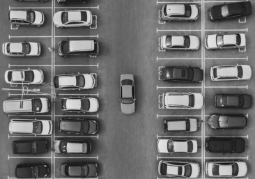
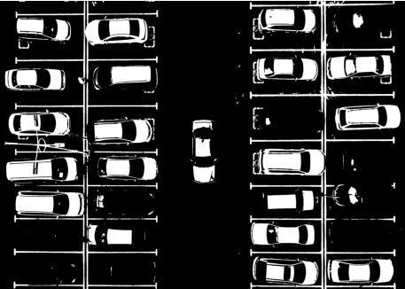
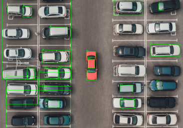

# Mini Project 2 — Object Counting (Hitung Jumlah Mobil)

**Mata Kuliah:** Pengolahan Citra dan Video  
**Nama:** Muhammad Arifin Umasangadji  
**NRP:** 5024241083  
**Departemen:** Teknik Komputer - ITS  

---

## 1. Deskripsi Tugas
Tugas ini bertujuan untuk menghitung jumlah mobil pada foto aerial (tampak atas) area parkir menggunakan teknik pengolahan citra digital. Tantangan utama dalam tugas ini adalah memisahkan bodi mobil dari aspal yang memiliki kemiripan warna serta membuang objek pengganggu seperti marka jalan dan garis parkir.

---

## 2. Hasil Deteksi
Berdasarkan pengujian menggunakan pipeline pengolahan citra yang dirancang:
> **Total Mobil Terdeteksi: 20 Mobil**

---

## 3. Penjelasan Pipeline
Proyek ini menggunakan pendekatan **Threshold-based Segmentation** yang dipadukan dengan **Morphological Operations** dan **Connected Components Analysis**. Berikut adalah detail langkah-langkahnya:

### A. Preprocessing (Grayscale & Gaussian Blur)
* **Filter:** `cv2.cvtColor` & `cv2.GaussianBlur`
* **Penjelasan:** Citra asli diubah ke skala abu-abu (grayscale) untuk memfokuskan pemrosesan pada intensitas cahaya. Selanjutnya, diterapkan Gaussian Blur untuk menghaluskan noise pada permukaan aspal agar tidak muncul bintik-putih (noise) saat proses segmentasi.

### B. Segmentasi (Otsu Thresholding)
* **Filter:** `cv2.threshold` (Metode Otsu)
* **Penjelasan:** Algoritma Otsu secara otomatis mencari nilai ambang batas (threshold) paling optimal. Tahap ini sangat krusial untuk memisahkan objek terang (mobil, garis putih) dari latar belakang yang gelap (aspal).

### C. Morphological Operations (Closing & Opening)
* **Filter:** `cv2.morphologyEx`
* **Penjelasan:** * **Closing:** Menggunakan kernel besar (15x15) untuk menyatukan bagian bodi mobil yang sering terpecah akibat kaca depan atau atap yang gelap.
    * **Opening:** Digunakan untuk "membersihkan" sisa-sisa garis parkir dan titik noise kecil yang masih lolos, sehingga hanya menyisakan blok putih yang masif (mobil).

### D. Contour Extraction & Filtering
* **Teknik:** `cv2.connectedComponentsWithStats`
* **Penjelasan:** Setiap blok putih dianalisis berdasarkan luas area dan rasio bentuknya. Filter diterapkan dengan parameter:
    * **Area:** > 3500 pixel (membuang noise kecil).
    * **Aspect Ratio:** Antara 0.6 hingga 2.5 (memastikan bentuknya proporsional sebagai mobil, bukan garis panjang).

---

## 4. Visualisasi Tahapan
Berikut adalah progres pengolahan citra dari setiap tahapan filter yang dilakukan:

| Tahap 1: Grayscale & Blur | Tahap 2: Otsu Threshold |
| :---: | :---: |
|  |  |
| *Menghaluskan tekstur aspal* | *Pemisahan awal objek* |

| Tahap 3: Morphology (Cleaning) | Tahap 4: Final Result |
| :---: | :---: |
| .png) |  |
| *Pembersihan garis parkir* | *Hasil deteksi 20 mobil* |

---

## 5. Analisis & Kendala
* **Analisis Akurasi:** Program berhasil mendeteksi 20 mobil secara bersih tanpa menyertakan marka jalan sebagai objek. Hal ini dicapai berkat penggunaan filter *aspect ratio* yang ketat.
* **Kendala:** Beberapa mobil yang memiliki warna sangat gelap (mendekati warna aspal) sulit tertangkap secara utuh. Jika parameter sensitivitas dinaikkan, marka jalan justru ikut terdeteksi. 20 mobil merupakan titik temu (trade-off) terbaik antara akurasi dan kebersihan deteksi.
* **Potensi Pengembangan:** Penggunaan teknik **Watershed** atau **Edge-based Detection** (seperti Canny/Sobel) dapat dikombinasikan untuk memisahkan mobil yang terparkir terlalu rapat.

---

## 6. Cara Menjalankan Program
1. Pastikan library `opencv-python`, `numpy`, dan `matplotlib` sudah terinstal.
2. Letakkan file `parking_ori.jpg` di folder utama.
3. Jalankan script:
   ```bash
   python counting.py
