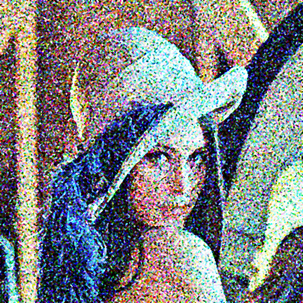

# Mini Project 1 — Image Restoration
**Mata Kuliah:** Pengolahan Citra dan Video 

* **Nama :** Muhammad Arifin Umasangadji
* **NRP  :** 5024241083

---

## Penjelasan Pipeline Restorasi
Beberapa tools yang digunakan dan langkah-langkahnya untuk mengatasi gambar noisy ini yakni adalah : 

| Langkah | Teknik | Penjelasan |
| :--- | :--- | :--- |
| **1** | **Median Filter ($3 \times 3$)** | Tahap awal untuk menghilangkan Salt-and-pepper noise karena efektif membuang nilai piksel tanpa merusak tepi objek. |
| **2** | **Gaussian Filter ($3 \times 3$)** | Digunakan untuk mereduksi Gaussian noise yang dengan menghaluskan citra agar bintik-bintik hilang. |
| **3** | **Histogram Equalization** | Memperbaiki citra low contrast, proses dilakukan dengan mengonversi RGB ke **Y (Luminance)**, melakukan ekualisasi intensitas, lalu mengalikan faktor skalanya kembali ke RGB asli agar warna kulit tetap natural. |
| **4** | **Sobel Edge Enhancement** | Teknik untuk memperkuat struktur citra. Dengan menghitung gradien $G_x$ dan $G_y$, tepi objek dideteksi lalu ditambahkan kembali ke citra untuk mengompensasi detail yang hilang akibat proses pembersihan noise. |
| **5** | **Unsharp Masking** | Tahap final sharpening, menggunakan selisih antara citra asli dan citra yang dikaburkan (mask) untuk menonjolkan frekuensi tinggi pada detail wajah, mata, dan topi. |

---

## Perbandingan Visual
Berikut merupakan hasil perbandingan antara citra input yang rusak dengan citra hasil restorasi akhir:

| Citra Input (Noisy) | Citra Output (Restored) |
| :---: | :---: |
|  |  |

---

## Analisis 
Restorasi citra Lena ini berhasil mengintegrasikan metode Median dan Gaussian Filter untuk menciptakan area tekstur kulit yang bersih dari noise impulsif maupun aditif tanpa menghilangkan esensi visual objek. Penggunaan teknik Luminance Scaling pada tahap ekualisasi histogram menjadi faktor kunci dalam meningkatkan kontras citra secara signifikan dengan tetap mempertahankan akurasi warna kulit yang natural. Meskipun detail halus pada mata dan rambut berhasil ditonjolkan melalui penajaman ganda (Sobel dan Unsharp Masking), proses ini masih memiliki kendala pada efisiensi waktu komputasi akibat penggunaan nested loop manual pada NumPy yang dapat dioptimalkan lebih lanjut menggunakan teknik vectorization. Selain itu, pengaturan threshold penajaman masih dapat disempurnakan untuk meminimalisir munculnya sedikit artefak ringing pada area dengan transisi intensitas yang sangat tajam.

---

## Cara Menjalankan Program
1. Pastikan library Python berikut sudah terinstal:
   ```bash
   pip install numpy opencv-python matplotlib
